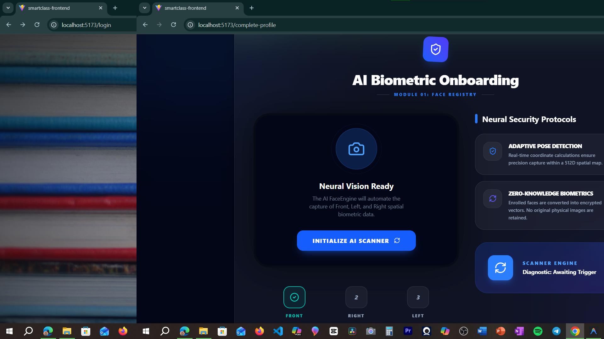

# 🎓 SmartClass AI - Premium Education Ecosystem (2026 Edition)


**SmartClass AI** is a state-of-the-art classroom management platform designed for the Year 2026. It integrates advanced Computer Vision for automated attendance, real-time teacher-parent reporting, and a premium Glassmorphism-inspired UI.

---

## 📺 Project Demo
*Experience the 2026 Education Ecosystem in action.*


---

## ⚡ Recent Progress & Core Features

### 🔐 AI Biometric Onboarding (V3)
- **Advanced Spatial Registration**: Parents capture 3 unique spatial face angles (Front, Left, Right) via a high-fidelity "Neural Vision" scanner.
- **Unified Camera Modal**: Integrated a premium, reusable `CameraModal` across all dashboards for instant, non-disruptive capture.
- **Biometric Encryption**: Real-time vectorization of face embeddings for maximum privacy and security.



### 📊 Professional Dashboards
- **Teacher Command Center**: Real-time attendance monitoring, AI-driven participation analytics (Radar charts), and direct parent reporting.
- **Admin Management Suite**: 
    - **Soft Delete**: Remove teachers/students from the active system while retaining audit history.
    - **Hard Delete**: Full database removal for permanent records cleanup.
    - **Profile Management**: Instant photo updates and credential management.
- **Parent Portal**: Real-time access to child engagement logs, attendance, and high-fidelity school calendars.

| Admin Dashboard | Teacher Dashboard |
|:---:|:---:|
|  |  |

### 🎨 2026 Design System
- **Glassmorphism**: Ultra-modern translucent UI elements with backdrop-blur and satin finishes.
- **Modern Theme Engine**: Instant switch between Light and Deep Space Dark modes with zero-latency persistence.
- **Fluid UX**: Micro-animations powered by **Framer Motion** and real-time state via **Zustand**.

---

## 🏗️ Technical Architecture

### AI Core (Attendance Pipeline)
- **Framework**: FastAPI (Python 3.10+)
- **Engines**: OpenCV + Face Recognition + Mediapipe
- **Resilience**: Intelligent CPU/GPU fallback for high-availability biometric processing.

### Web Ecosystem
- **Frontend**: Vite + React 18 + Tailwind CSS + shadcn/ui
- **Backend**: FastAPI + SQLAlchemy (Standardized V2 Models)
- **State Management**: Zustand (Global) + WebSocket (Real-time Broadcasts)
- **Database**: PostgreSQL / SQLite hybrid for production reliability.

---

## 🚀 Launching the System

### Prerequisites
- Node.js (v18.0+)
- Python (v3.9+)
- NPM

### Step-by-Step Launch

1. **Start the AI Backend**
   ```bash
   cd "Attendance pipeline"
   python server_v2.py
   ```
   *Service will run on http://localhost:8000*

2. **Start the Frontend Application**
   ```bash
   cd "smartclass-frontend"
   npm install
   npm run dev
   ```
   *Application will be available at http://localhost:5173*

---

## 🛠️ Reliability & Maintenance

The system has undergone a full **Production Reliability Audit**:
- **Hardened State**: Eliminated "white screen" bugs with robust null-checks.
- **Theme Stabilization**: Added persistent theme-sync to eliminate load flicker.
- **Session Safety**: Use the **Hard Reset** button on the login/load screen to clear stale sessions.

---
*© 2026 SmartClass AI Inc. Future-Proof Education Management.*
